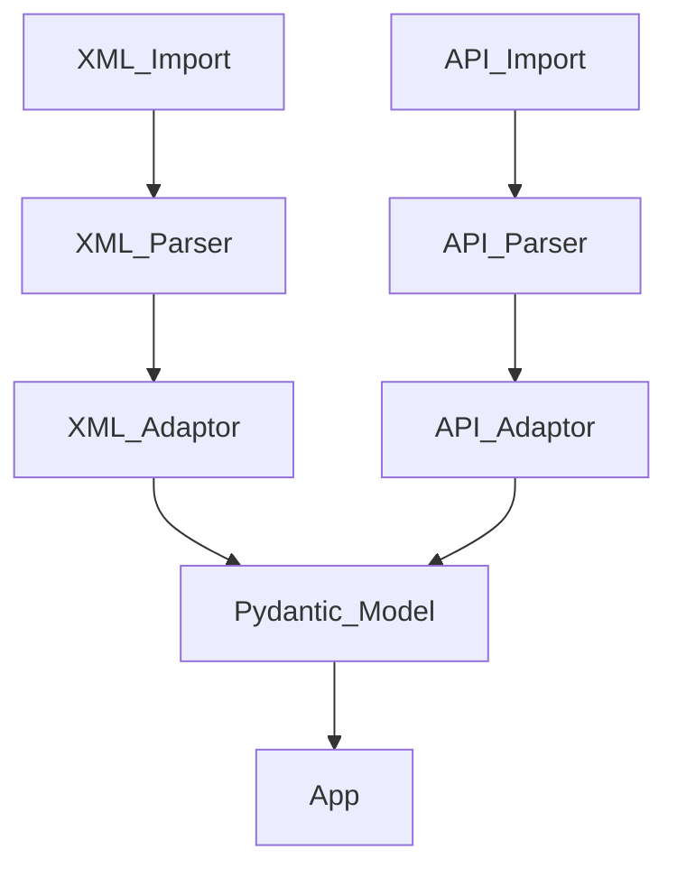
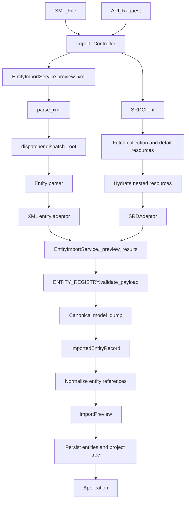

```mermaid
flowchart
    XML_Import --> XML_Parser
    XML_Parser --> XML_Adaptor
    XML_Adaptor --> Pydantic_Model

    API_Import --> API_Parser
    API_Parser --> API_Adaptor
    API_Adaptor --> Pydantic_Model

    Pydantic_Model --> App

```

### Current processing flow

```mermaid
flowchart TD
    XML_File --> Import_Controller
    Import_Controller --> XML_Preview[EntityImportService.preview_xml]
    XML_Preview --> XML_Parse[parse_xml]
    XML_Parse --> XML_Dispatch[dispatcher.dispatch_root]
    XML_Dispatch --> XML_Parser[Entity parser]
    XML_Parser --> XML_Adaptor[XML entity adaptor]
    XML_Adaptor --> Shared_Validation

    API_Request --> Import_Controller
    Import_Controller --> API_Client[SRDClient]
    API_Client --> API_Fetch[Fetch collection and detail resources]
    API_Fetch --> API_Hydrate[Hydrate nested resources]
    API_Hydrate --> API_Adaptor[SRDAdaptor]
    API_Adaptor --> Shared_Validation

    Shared_Validation[EntityImportService._preview_results]
    Shared_Validation --> Registry[ENTITY_REGISTRY.validate_payload]
    Registry --> Model_Dump[Canonical model_dump]
    Model_Dump --> Record[ImportedEntityRecord]
    Record --> References[Normalize entity references]
    References --> Preview[ImportPreview]
    Preview --> Commit[Persist entities and project tree]
    Commit --> App[Application]
```